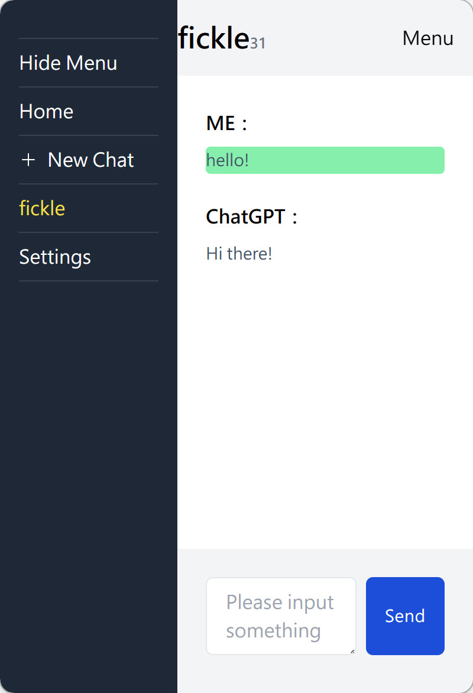

# original from
[https://github.com/lianginx/chatgpt-vue](https://github.com/lianginx/chatgpt-vue)
# chatgpt-vue

A simple chat dialogue using Vue3 + Typescript + Tailwind CSS framework, utilizing OpenAI’s gpt-3.5-turbo model API, supporting continuous dialogue(maximum 3072 tokens).



## Installation

```bash
npm i
npm run dev
```

or

```bash
yarn
yarn dev
```

finally：

```bash
VITE v3.2.5  ready in 294 ms

➜  Local:   http://localhost:5173/
➜  Network: use --host to expose
```

# Starting Guide

1. Enter Settings and import an API key.

2. Create a new conversation and start chatting.

# Conversation Log

* Single click: View conversation contents.  
* Trash can: Clear the conversation.
# Features

1. This system uses the gpt-3.5-turbo model.  
2. All logs are stored locally in localStorage.  
3. Conversation logs are limited to a maximum of 4096 tokens. If exceeded, chatGPT will display a prompt and you’ll need to create a new conversation.

## License

This project is licensed under the [MIT](LICENSE) license.
