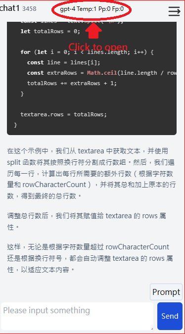

# original from
[https://github.com/lianginx/chatgpt-vue](https://github.com/lianginx/chatgpt-vue)

# Demo
https://kodakjerec.github.io/yourChatGPT/

# chatgpt-vue

A chat dialogue using Vue3 + Typescript + Tailwind CSS framework, utilizing OpenAI’s gpt-4 model API, supporting continuous dialogue.

# Starting Guide

1. Enter __Settings__ and import an API key.  
2. Create a new __Chat__ and start chatting.  
3. __Prompts__ import/export prompts if you want.
4. __Transcription__ can record your voice and translate it into the desired language.

# How to use
## Main


"+New Chat": This option allows you to add a new chat log.  
"Prompts": Use this for importing/exporting prompts.  
"Settings": Login with Google, manage your API key and adjust all other settings.  

## Chat Setting



In the chat log, click on the words in the middle-top to open the settings dialog. Here, you can adjust settings for your ChatGPT Model and other preferences. 

## Import Prompts


There are two styles of import supported. You can download prompt files from other sites.

## Use Prompts


In the chat log, when you scroll to the bottom of the screen, you'll see a "Prompt" button above the Send button. Click on "Prompt", and a widget will appear. Type in your search keyword and then click on 'prompt'; this will import your prompt into the chat.
# Installation

```bash
npm i
npm run dev
```

or

```bash
yarn
yarn dev
```

finally：

```bash
VITE v3.2.5  ready in 294 ms

➜  Local:   http://localhost:5173/
➜  Network: use --host to expose
```

# Features

1. This system uses the gpt-4 model.  
2. All logs are stored locally in local-Storage.  
If you have connected with Google-account, you can easily synchronize your logs across different devices.

## License

This project is licensed under the [MIT](LICENSE) license.
